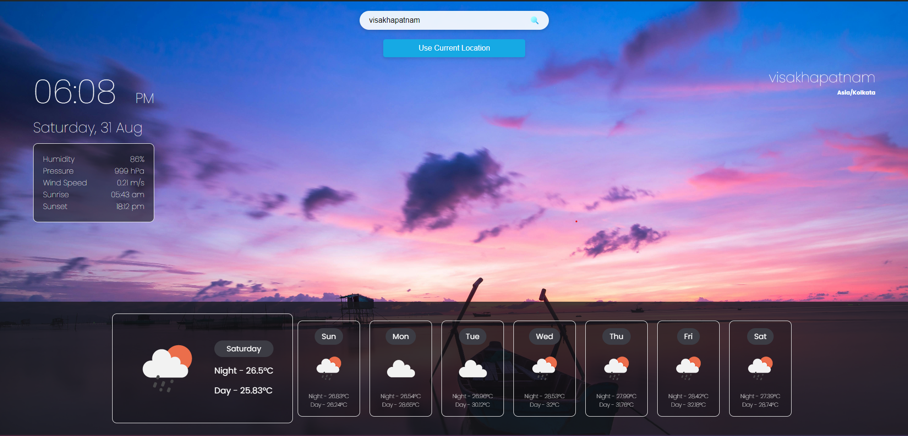
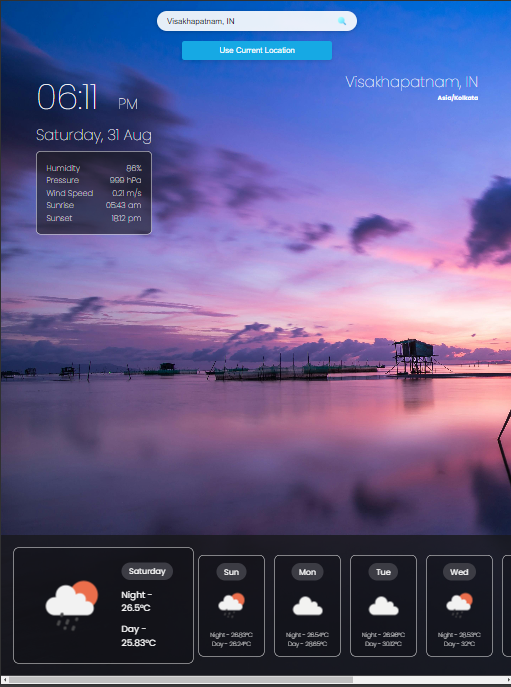
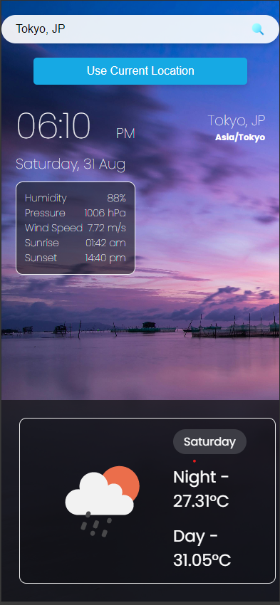

# Weather Forecasting Web App

## Project Overview
This Weather App provides real-time weather information and forecasts for any city you search or your current location. The app fetches data from the OpenWeatherMap API and displays current weather conditions, including temperature, humidity, wind speed, and a 7-day forecast. It is fully responsive, ensuring a seamless experience across different screen sizes.

##Deployement
https://kaarthik-96.github.io/weatherForecastingWebApp/

## Screenshots

### Desktop View


### Tablet View


### Mobile View


## Setup and Run Locally

To set up and run the project locally, follow these steps:

### Prerequisites
- An API key from [OpenWeatherMap](https://openweathermap.org/api)

### Installation
1. **Clone the repository:**
    ```bash
    git clone https://github.com/kaarthik-96/weather-app.git
    cd weather-app
    ```

2. **Set up the API Key:**
   - Open the `script.js` file in the root directory.
   - Replace `YOUR_API_KEY_HERE` with your OpenWeatherMap API key:
     ```javascript
     const API_KEY = 'YOUR_API_KEY_HERE';
     ```

3. **Open the `index.html` file in your browser:**
   - You can directly open the file in your browser or use an HTTP server to serve the files:
     ```bash
     npx serve
     ```
   - Then, navigate to `http://localhost:5000` or the displayed address.

## API Usage Details

This app uses the OpenWeatherMap API to fetch weather data. Two main endpoints are utilized:

1. **Current Weather Data:**
   - Endpoint: `https://api.openweathermap.org/data/2.5/weather`
   - Parameters: 
     - `q`: City name
     - `units`: Metric (Celsius)
     - `appid`: Your API key

2. **One Call API:**
   - Endpoint: `https://api.openweathermap.org/data/3.0/onecall`
   - Parameters: 
     - `lat`: Latitude
     - `lon`: Longitude
     - `exclude`: Parts of the data to exclude (e.g., `hourly,minutely`)
     - `units`: Metric (Celsius)
     - `appid`: Your API key

## Approach

The app was developed with a focus on user experience and responsiveness. It leverages HTML, CSS, and JavaScript for the frontend, making asynchronous API requests to fetch weather data. The design ensures that the app looks good and functions well on various devices, from desktops to smartphones. The code structure is modular, with clear separation between the presentation layer (HTML/CSS) and logic (JavaScript).

